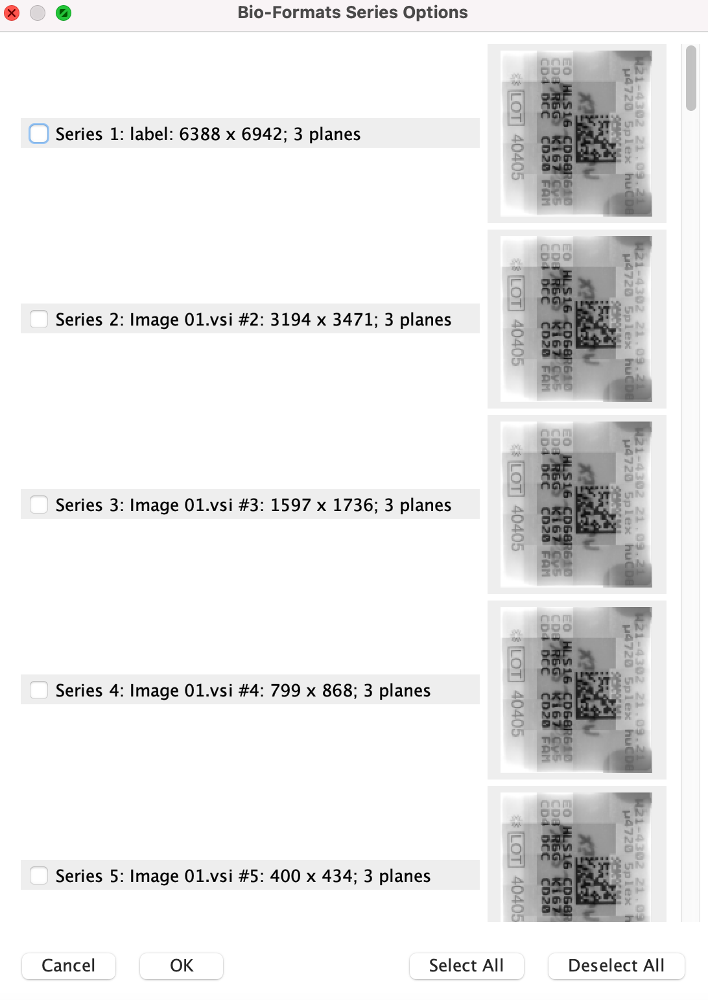
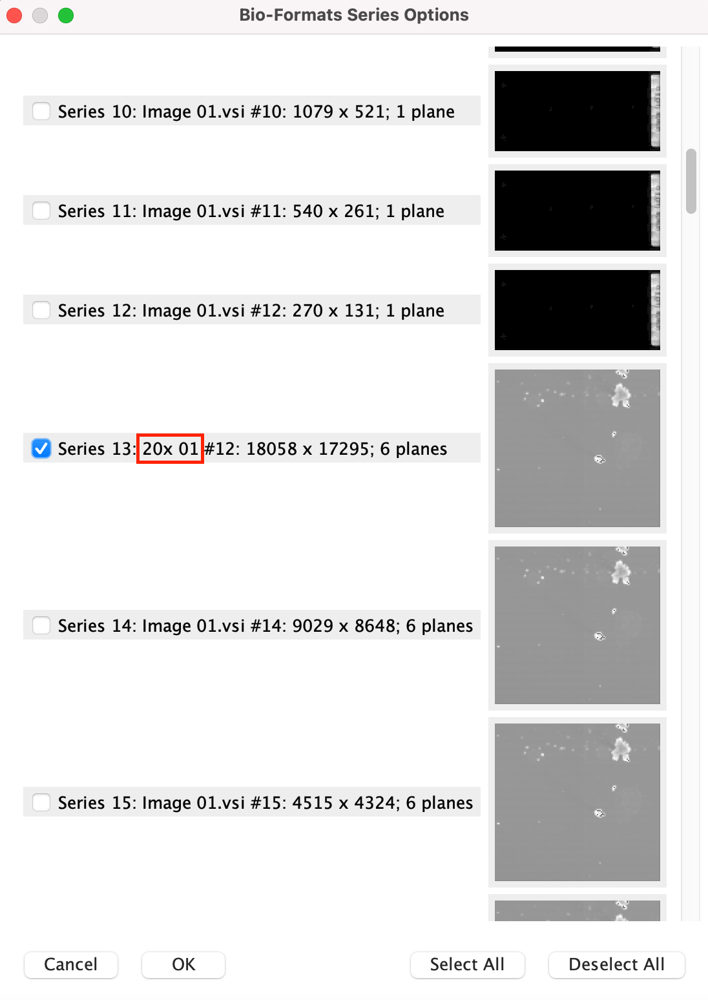
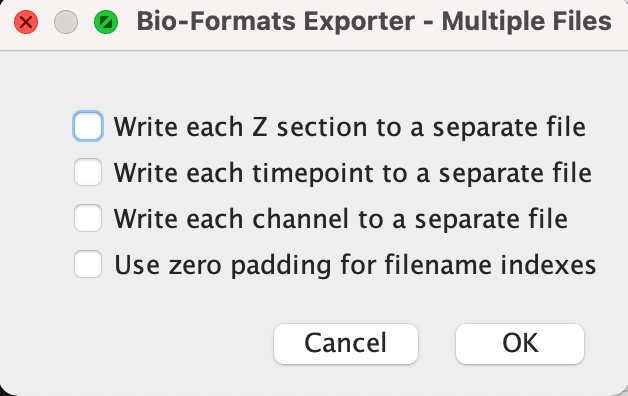

# Lymphomoid’s IF analysis pipeline
This pipeline was put together by Daniele Tavernari and Marco Varrone in December 2021 to streamline the analysis of multicolor immunofluorescence (IF) images of lymphoma and lymphomoid samples. It involves both manual and automated steps using open source tools and custom scripts that we developed. The pipeline is not optimal and can be improved in some of its parts. Feel free to adapt / modify / further develop the pipeline itself or the scripts involved, and reach out to us if you want to discuss.

## Step 1 - Image loading and inspection on QuPath
A good starting point is to load and visualize your IF image on QuPath. You can download QuPath and browse its documentation [here](https://qupath.github.io/). You can install QuPath on your local machine and open images stored on the server by mounting the corresponding folders on your local machine. Be aware that huge images require a good internet connection to be loaded and inspected without lags. A good amount of RAM is also advisable. 

QuPath is organized into “projects”. When you create a new project, you will be asked to allocate an empty folder to it. Then, you can add images to the project. It is fast to switch between images of the same project, and you will see the thumbnails of all of them at the same time; conversely, to inspect the images of a different project you will have to close the current one and open the other. This can affect the way you want to organize your project(s): I recommend to put related images into the same project (e.g. all images of the same patient, or of the same treatment). It is in principle also possible to store all images of all patients in the same project, but it probably would become messy.

When loading a .vsi raw image file, sometimes the same file will contain more than one image (different acquisitions of the same sample, or even different samples). Discard those that are unusable (e.g. out of focus, or with too little tissue and only fatty holes). Instead, for the good images, change their QuPath image name into a meaningful one (sometimes the name of the raw file is just e.g. “Image_10.vsi” - you might want to change it into e.g. “HLS23_s12_acq01”, which mentions the Human Lymphoma Sample number, the paraffin section, and the acquisition ID of that section).  It is advisable to rename them in a clear and consistent way.

Now you can explore the loaded image. If needed, set its type into "Fluorescence". You can change brightness, contrast and show/hide the different channels, corresponding to the different stained proteins. Sometimes it is useful to look at a single channel in grayscale mode. 

In the first batch of images, the channel-protein association was: 
* DAPI = Nuclei staining
* FITC = CD20 (B cells)
* CY5 = KI67 (proliferation)
* CFP = CD4 (CD4 T cells)
* RFP = CD8 (CD8 T cells)
* Alexa 594 = CD68 (macrophages)


## Step 2 - Lymphomoid(s) boundary drawing
In this step, you will draw and save the coordinates of the boundaries of all lymphomoids present in the image, so that they will be processed separately in the downstream analyses, and pieces of tissue scattered around the gel will be discarded.
1. For each lymphomoid, draw a closed boundary with QuPath polygon tool
2. Open _getBoundary.groovy_ script in QuPath script editor (Automate -> Show script editor)
3. In the script, set the absolute path to your desired output directory (_OutDir_) and the image name (_ImageName_)
4. For each boundary:
   * Select the boundary itself (double click - a selected boundary is displayed in yellow)
   * Set the lymphomoid name in the script (_LymphomoidName_). Be careful in this passage: if the same lymphomoid appears in different images, they should all have the same _LymphomoidName_. In this way, different acquisitions (encoded with different _ImageName_'s) will be treated as replicated measurements of the same lymphomoid in the downstream analyses
   * Run the script


## Step 3 - Fluorescence threshold calibration on the image
In this step, you will tune the thresholds for each channel to classify a cell as "positive" or not for each of the proteins. To do so, a script will automatically detect nuclei and classify cells according to the thresholds that you give it as input (for DAPI and Ki67, cells will be classified according to the fluorescence levels inside the nuclei; for all other markers, the fluorescence levels will be thresholded in the cytoplasmic regions). Tune the threshold of each channel until you are satisfied with the classification. Finally, the script stores all the tuned thresholds in a text file, that will be used in the downstream analyses. Here are the detailed (sub)steps:
1. Draw a rectangular region that seems to contain cells positive for each of the channels
2. Open _calibrateThresholds.groovy_ script in QuPath script editor
3. In the script, set the absolute path to your desired output directory (_OutDir_) and the image name (_ImageName_) in the _Input_ section. These have to be the same as for the boundary drawing (Step 2, point 3).
4. Tune the DAPI threshold first:
   * In the 'Brigthness & contrast' menu, turn off all channels except for DAPI, and set it to grayscale
   * Hover the cursor on the nuclei to have an idea on what might be the threshold
   * Assign a reasonable threshold guess to the _DAPI_thresh_ variable in the _Input_ section of the script
   * Run the script and inspect the results visually. You can view/hide the detections in QuPath with View->Show detections (Keyboard shortcut: D)
   * If nuclei have been under- (or over-) called, change the DAPI threshold and re-run the script until you are satisfied with the results
5. Tune the FITC threshold:
   * In the 'Brigthness & contrast' menu, show the FITC channel
   * Hover the cursor on the FITC stained cytoplasms to have an idea on what might be the threshold
   * Assign a reasonable threshold guess to the _FITC_thresh_ variable in the _Input_ section of the script
   * In the _Calibration_ section of the script, uncomment the line related to the FITC classification (_setCellIntensityClassifications("Cytoplasm: FITC mean", FITC_thresh_) by removing the groovy comment symbol ('//') 
   * Run the script and inspect the results visually. Cells positive for FITC will appear in red, negative cells will be blue.
   * Tune the FITC threshold and re-run the script until you are satisfied with the results
   * Once you are done, comment out again the line related to the FITC classification. Don't ever comment out the line related to the DAPI nuclei detection.
6. Repeat step 5 for all the other channels. Remember that at every tuning round only two lines in the _Calibration_ section should be uncommented: the DAPI detection and the intensity classification of your channel of interest
7. If you wish, repeat all the steps from 1 to 6 drawing a different rectangular region, to test whether your thresholds would stay the same or not
8. At each run, the script is saving and overwriting the output file with all the thresholds. Thus, your last run should be done with all the thresholds already tuned, as the final output file will be saved with those. If you want to run the script without saving the file, comment out the _Saving_ section

## Step 4 - Nuclei detection and cell-level quantification with DeepCell (work in progress)
DeepCell is a nuclei and cell segmentation software that is more robust to different levels of marker intensity and, thus, gives better results when the intensity of DAPI varies dramatically in the same sample.

The whole process of detecting cells and extract the intensity of the markers is fairly automatized. The crucial step is to setup the input directories and files properly.


### Setup of the input directories
Given that the software is already installed on the uporicchiosrv1 server, and the process requires quite heavy computation resources, it's strongly suggested to setup the directories on the server.

Create a directory on the server that will contain the input and output folders. Do not use the same directory as the one containing the original .vsi images because you will need to convert those images into another format.

Mount the newly created directory to your local machine (e.g., _HLS\_Quantification_). If you are using _sshfs_ on a Mac, add the `-o defer_permissions` parameter to avoid problems of permission denied when saving files.

Then, create a new directory inside _HLS\_Quantification_ for each of the images. And inside each of these, create a directory called _registration_.

For example:

```bash
HLS_Quantification
├── HLS25_7
│   ├── registration
├── HLS25_41acq01
│   ├── registration
├── HLS25_41acq03
│   ├── registration
...
```

### VSI to .OME.TIF format conversion
In this step we will convert the images from the .vsi to the .ome.tif format. It requires the [ImageJ](https://imagej.nih.gov/ij/download.html) or [Fiji](https://imagej.net/software/fiji/) software.
For each of the images:
1. Open the .vsi image in ImageJ/Fiji
2. A popup called "BioFormats Import Options" will open. Press OK without any modification.
3. Another popup with a list of images will appear.<br><p align="center"> </p><br>
4. The first image will be automatically selected. Deselect it.
5. Scrolling down you will start to see acquisitions of the lymphomoids and each acquisition will be repeated many times. Each replicate is the same acquisition at different resolutions. Select only the images that correspond to the highest resolution, which usually have _20x\_NUMBER_ in their name. IMPORTANT: do not select images that were discarded in QuPath in Step 1. It may take a while (5-10 minutes) to open them. <br><p align="center"> </p><br>
6. After the images are loaded in ImageJ/Fiji, for each one of them individually, click on File -> Save as -> OME-TIFF... (it's one of the last options) and select the registration folder corresponding to the selected image. It's strongly suggested to use as name of the file, the same name of the corresponding folder (see next directory structure...). IMPORTANT: rember to add ".ome.tif" at the end of the filename or you will receive an error.
7. Another popup will open up. Leave everything unselected and press OK. <br><p align="center"> </p><br>

The directory structure should now look like:
```bash
HLS_Quantification
├── HLS25_7
│   ├── registration
│   │   ├──HLS25_7.ome.tif
├── HLS25_41acq01
│   ├── registration
│   │   ├──HLS25_41acq01.ome.tif
├── HLS25_41acq03
│   ├── registration
│   │   ├──HLS25_41acq03.ome.tif
...
```

### Cell detection (i.e. segmentation)
The cell detection script require few Python packages for basic file processing. They are all already installed as a Python virtual environment in _/mnt/data2/shared/Lymphomoid-IF-software/Lymphomoid-IF-venv/_.
To be able to access the packages you need to activate the environment using:

`source /mnt/data2/shared/Lymphomoid-IF-software/Lymphomoid-IF-venv/bin/activate`

Then you need to run the _cellDetection.py_ script, with the following required parameters:
- `--sample_names`: the name of the images for cell detection, it could be 1 or many, separated by a whitespace.
- `--dir`: the path of the _HLS\_Quantification_ directory
- `--channel_info_path`: the path to the .txt or .tsv file containing information on the image channels. The values must be separated by tabs. In particular, the file must contain a _Channel\_name_ and a _Cellular\_location_ (Nucleus or Cytoplasm) column.

<details>
<summary>Some other parameters may be required in case of non-standard uses of the pipeline, so they can usually be ignored</summary>

* `--deepcell_path`: the absolute path to the Singularity image of DeepCell. The default is `/mnt/data2/shared/Lymphomoid-IF-software/deepcell.sif` where is already present.
* `--nucleus_channel`: the name of the channel associated to the nuclear marker (e.g. DAPI). The default is `DAPI`.

</details>

An example of the script calling is: `python3 cellDetection.py --dir /mnt/data2/varrone/elisa_lymphomoids/HLS_Quantification/ --sample_names HLS25_7 HLS25_41acq01 HLS25_41acq03 --channel_info_path /mnt/data2/varrone/elisa_lymphomoids/mouse_channels.txt`

A lot of warning messages will appear, but they are normal. As long as the message `Channels extracted successfully.` appears, the software will have worked successfully. 

The run may take a while for each image (tens of minutes). For this reason, it is suggested to pass many images at the same time through the `--sample_names` parameters and run the script overnight.

### Marker quantification (i.e. segmentation)
This step obtains for each cell, from its mask detected in the cell detection step, the mean intensities of each of the markers in the nucleus and in the cytoplasm.

If the virtual environment has not been activated from the cell detection part, run the `source /mnt/data2/shared/Lymphomoid-IF-software/Lymphomoid-IF-venv/bin/activate` command to activate the virtual environment.

Then, run the _quantifyIntensities.py_ script, with the same required parameters as in the cell detection step:
* `--sample_names`: the name of the images for cell detection, it could be 1 or many, separated by a whitespace.
* `--dir`: the absolute path of the _HLS\_Quantification_ directory

<details>
<summary>Parameters for non-standard uses of the pipeline</summary>

* `--nextflow_dir`: path to the Nextflow software. The default is `/mnt/data2/shared/Lymphomoid-IF-software/nextflow` where is already present.

</details>

An example of the script calling is: `python3 quantifyIntensities.py --dir /mnt/data2/varrone/elisa_lymphomoids/HLS_Quantification/ --sample_names HLS25_7 HLS25_41acq01 HLS25_41acq03`.

### Optional: downloading the software
As previously mentioned, the directory containing all the necessary software is already present in the uporicchiosrv1 server. 

If you want to download or update the four software required:
* Virtual Environment: the Python packages required for running the pipeline are listed in the file _requirements.txt_. If you want to install the packages in your current virtual environment you can run `pip install -r requirements.txt`.
* DeepCell: the image for Singularity can be downloaded running `singularity pull deepcell.sif docker://vanvalenlab/deepcell-applications:latest`. Current version: 0.3.1.
* Nextflow: select the directory where ypu want to download nextflow and run `curl -s https://get.nextflow.io | bash`. For more information visit the [website](https://nextflow.io). Current version: 21.10.6.5660.
* MCMICRO: you can get the latest version of MCMICRO by running `nextflow pull labsyspharm/mcmicro`. For more information visit the [website](https://mcmicro.org). Current version: Github revision 46abd97bc0.

## Step 5 - (downstream analyses)

